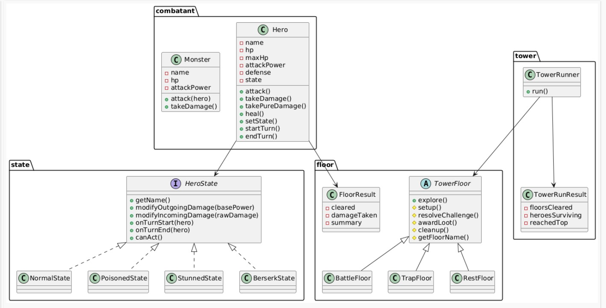

# Homework 8 — The Haunted Tower: Ascending the Floors

## Overview

In this assignment you will implement two behavioral design patterns — **State** and **Template Method** — inside a tower-climbing RPG.

Heroes ascend a tower floor by floor, each hero carrying internal states that affect their combat performance and can transition on their own (poison wears off, stun clears, rage ignites under low HP). Each floor is a specialization of an abstract floor archetype whose structure is fixed by a template method — subclasses fill in the pieces and may override optional hooks.

This homework explores how the two patterns solve different problems without depending on each other structurally.

---

## Patterns Covered

| Pattern | Role in this system |
|---------|-------------------|
| **State** | Governs *intra-entity behavior changes* — each hero carries a `HeroState` that modifies damage dealt/received and can self-transition. The hero's state is its own responsibility. |
| **Template Method** | Governs *inter-activity algorithm structure* — each `TowerFloor` subclass follows a fixed skeleton (`announce → setup → resolveChallenge → awardLoot → cleanup`); subclasses fill in the abstract steps and may override optional hooks. |

These patterns are independent — State does not depend on Template Method, and vice versa. Seeing each in isolation is a core learning goal.

---

## What Is Provided

| File | Description |
|------|-------------|
| `src/com/narxoz/rpg/state/HeroState.java` | State interface |
| `src/com/narxoz/rpg/floor/TowerFloor.java` | Abstract class with template method |
| `src/com/narxoz/rpg/floor/FloorResult.java` | Floor exploration result data class |
| `src/com/narxoz/rpg/combatant/Hero.java` | Hero skeleton |
| `src/com/narxoz/rpg/combatant/Monster.java` | Monster concrete class |
| `src/com/narxoz/rpg/tower/TowerRunResult.java` | Tower run result data class |
| `src/com/narxoz/rpg/Main.java` | Entry point skeleton |

Everything else — concrete `HeroState` implementations, concrete `TowerFloor` subclasses, tower runner logic, and the demo — is yours to design and build.

---

## Quick Start

```bash
# Compile
javac -d out $(find src -name "*.java")

# Run
java -cp out com.narxoz.rpg.Main
```

See `QUICKSTART.md` for IDE setup and detailed instructions.

---

## Read Next

- `ASSIGNMENT.md` — full requirements, pattern contracts, and grading rubric
- `STUDENT_CHECKLIST.md` — phase-by-phase progress tracker
- `FAQ.md` — answers to common questions about the patterns and implementation

### FullDiagram


## Ссылка на код
https://github.com/zarina-kulm/homework-rpg-8
